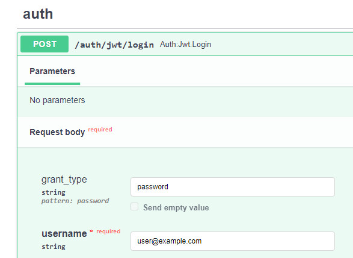

# 📚 FastAPI Бэкенд инвестиционной платформы


FastAPI-приложение инвестиционная платформа. Поддерживает регистрацию пользователей, REST API компаний и активов.


## Основные возможности
- **Регистрация и авторизация** — реализована с помощью FastAPI Users. Пользователи могут зарегистрироваться и входить в систему.
- **CRUD для компаний и активов** — добавление, обновление, удаление и просмотр информации о компаниях и их активах.
- **Покупка и продажа активов** — возможность покупать/продавать активы компаний.


## Перед запуском

Приложение использует API finnhub.io для получения данных компаний и активов. Необходимо получить API ключ сервиса.
Может не работать без VPN.


## Установка и запуск


```bash
git clone https://github.com/Relanit/fastapi_rest.git
cd fastapi_rest
docker compose up -d
```

Документация API будет доступна по адресу: http://localhost:9999/docs

Примечание: при логине через документацию, в поле "username" нужно вводить email, указанный при регистрации:



## Запуск тестов
```bash
docker compose exec app pytest -v -s
```


